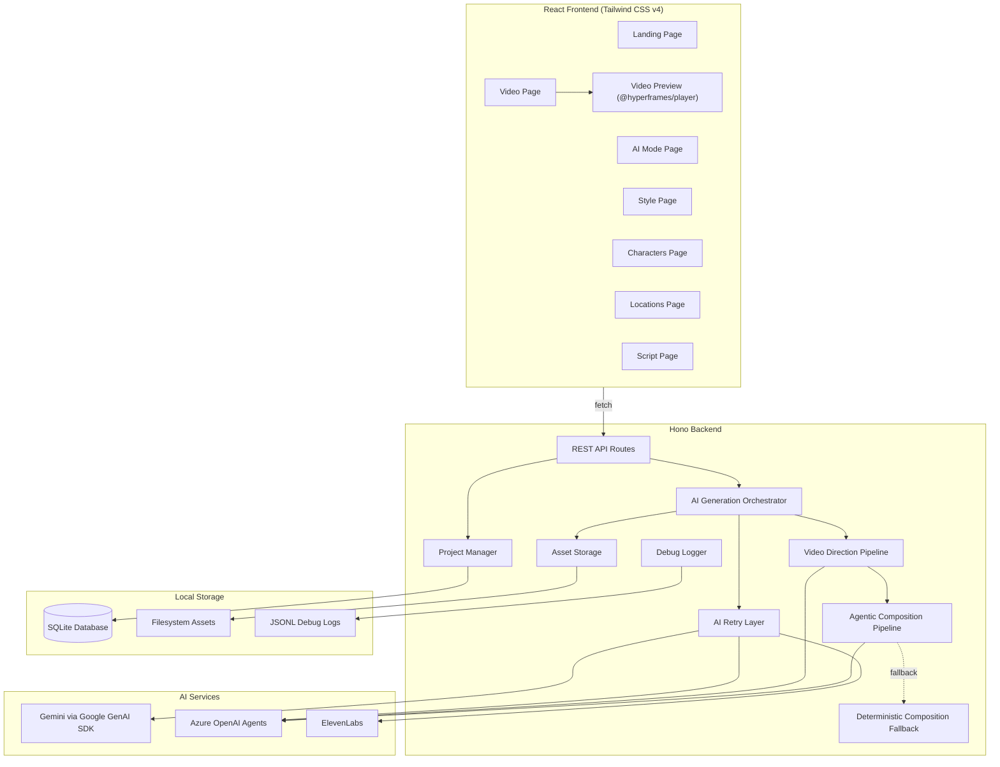

# Design Document: Animated Story Creator

## Overview

The Animated Story Creator is a full-stack web application that enables users to produce animated video stories by orchestrating multiple AI services. The system follows a pipeline architecture: users define creative inputs (style, characters, locations), the backend coordinates AI services to generate assets (images, audio, music, sound effects), and a multi-stage video pipeline produces a playable HyperFrames composition.

Two creation modes are supported:
- **AI Mode**: A single prompt triggers end-to-end pre-production: style generation, character creation with portraits and custom-designed voices, location creation with background images, and a story brief — all via structured AI output.
- **Manual Mode**: Users build each element step-by-step through a guided workflow (Style, Characters, Locations, Script, Video).

The frontend is a React SPA styled with Tailwind CSS v4 featuring a distinctive visual identity. The backend is a Hono server that proxies all AI service calls, manages asset storage on the local filesystem, and persists project data in SQLite with WAL mode. Video generation follows a three-stage pipeline: (1) AI-driven video direction planning (shot-by-shot), (2) agentic HTML composition via Azure OpenAI multi-agent pipeline, (3) deterministic fallback composition if the agentic pipeline fails. All compositions are HyperFrames-compatible HTML with GSAP animations, previewed in-browser via `@hyperframes/player`.

### Key Design Decisions

1. **Backend-proxied AI calls**: All AI service keys remain server-side. The frontend never touches API keys.
2. **Asset-on-disk model**: Generated images and audio files are stored on the local filesystem and served statically. The database stores metadata and file paths only.
3. **HyperFrames HTML as composition format**: Video compositions are HTML files with `data-*` attributes for timing and GSAP timelines for animation. This allows both AI-generated and deterministic compositions to use the same playback engine.
4. **Predefined effect and scene presets**: Animation effects and scene compositions are authored ahead of time as GSAP timeline snippets and layout templates. The AI selects from these presets rather than generating arbitrary animation code, ensuring visual quality and GSAP compatibility.
5. **Provider abstraction**: Text/image generation is abstracted behind a `TextImageProvider` interface so Gemini and Azure OpenAI can be swapped or used together. A factory function selects the provider based on environment configuration.
6. **Structured AI output**: Gemini's structured JSON output (via `generateStructured`) is used extensively for style, characters, locations, brief, and script generation — eliminating fragile text parsing.
7. **Multi-agent video pipeline**: Video direction and HTML composition use Azure OpenAI's agent framework with specialized agents (preset reviewer, section planner, critic, director for direction; playbook author, blueprint author, HTML author, repair agent for composition).
8. **Deterministic fallback**: A code-driven composition generator (`buildDeterministicComposition`) produces valid HyperFrames HTML without any AI calls, ensuring video generation always succeeds even if the agentic pipeline fails.
9. **AI retry with backoff**: All AI service calls are wrapped in a retry utility (`withAiRetries`) with configurable attempts, exponential backoff, and smart non-retryable error detection.
10. **Debug logging via async context**: An `AsyncLocalStorage`-based debug logger records every AI call (prompt, response, timing, errors) to per-project JSONL files, enabling post-hoc debugging without polluting application logic.
11. **Story language detection**: The backend infers the story language from the user's prompt (Spanish/English heuristic with fallback) and instructs all AI services to generate content in the same language.
12. **Custom voice design**: Instead of selecting from stock voices, the system uses ElevenLabs' voice design API to create unique voices per character based on AI-generated voice prompts, with preset fallback voices for resilience.

## Architecture



### Request Flow

1. User interacts with the React frontend.
2. Frontend sends `fetch` requests to Hono backend REST endpoints.
3. Backend routes dispatch to the Project Manager (CRUD) or AI Generation Orchestrator (asset generation).
4. The AI Orchestrator calls the appropriate external service (Gemini, Azure OpenAI, or ElevenLabs) through the retry layer.
5. All AI calls are logged by the Debug Logger via async local storage context.
6. Generated assets are saved to the filesystem; metadata is persisted in SQLite.
7. The frontend receives asset URLs and metadata, rendering them in the UI.
8. For video composition:
   a. The Video Direction pipeline generates a shot-by-shot plan using Azure OpenAI agents.
   b. The Agentic Composition pipeline generates HyperFrames HTML using Azure OpenAI agents (playbook → blueprint → HTML authoring → validation/repair).
   c. If the agentic pipeline fails, the Deterministic Composition fallback generates HTML programmatically.
9. The frontend renders the composition using `@hyperframes/player`.

## Components and Interfaces

### Frontend Components

| Component | Responsibility |
|-----------|---------------|
| `LandingPage` | Project list, create new project, select mode |
| `AiModePage` | AI Mode prompt input, progress polling with creative stage labels, redirect to project on completion |
| `StylePage` | Style configuration with genre-organized predefined presets (with swatches and previews) and custom fields |
| `CharactersPage` | Add/edit/remove characters, trigger portrait and voice generation, display voice previews |
| `LocationsPage` | Add/edit/remove locations, trigger background image generation |
| `ScriptPage` | Display/edit script sections with dialogue, narration, music/SFX cues; trigger script and audio generation |
| `VideoPage` | Trigger video composition generation, display progress, embed video preview |
| `ProjectLayout` | Step-by-step workflow navigation (Style → Characters → Locations → Script → Video) |
| Shared UI | `Button`, `Input`, `Card`, `LoadingSpinner`, `ErrorToast`, `AudioPlayer`, `PageHeader` — all using Tailwind CSS and lucide-react icons |

### Backend Route Modules

| Module | Base Path | Description |
|--------|-----------|-------------|
| `project-routes` | `/api/projects` | Project CRUD (list, create, get, update) |
| `style-routes` | `/api` | Style presets listing and project style save/update |
| `character-routes` | `/api/projects/:id/characters` | Character CRUD, portrait generation, voice design |
| `location-routes` | `/api/projects/:id/locations` | Location CRUD, background image generation |
| `script-routes` | `/api/projects` | Script generation and section editing |
| `audio-routes` | `/api/projects` | Audio generation (narrator, dialogue, music, SFX) |
| `video-routes` | `/api/projects` | Video direction + composition generation |
| `ai-mode-routes` | `/api/projects` | AI Mode pre-production pipeline with progress polling |
| `debug-routes` | `/api/debug` | Debug log retrieval for AI call inspection |

### Backend API Endpoints

| Method | Path | Description |
|--------|------|-------------|
| `GET` | `/api/projects` | List all projects |
| `POST` | `/api/projects` | Create a new project |
| `GET` | `/api/projects/:id` | Get project with all associated data |
| `PUT` | `/api/projects/:id` | Update project metadata and brief |
| `GET` | `/api/style-presets` | List all predefined style presets by genre |
| `POST` | `/api/projects/:id/style` | Save/update style configuration |
| `POST` | `/api/projects/:id/characters` | Add a character |
| `PUT` | `/api/projects/:id/characters/:charId` | Update a character |
| `DELETE` | `/api/projects/:id/characters/:charId` | Remove a character |
| `POST` | `/api/projects/:id/characters/:charId/generate-portrait` | Generate character portrait image |
| `POST` | `/api/projects/:id/characters/:charId/generate-voice` | Design custom voice for character |
| `POST` | `/api/projects/:id/locations` | Add a location |
| `PUT` | `/api/projects/:id/locations/:locId` | Update a location |
| `DELETE` | `/api/projects/:id/locations/:locId` | Remove a location |
| `POST` | `/api/projects/:id/locations/:locId/generate-image` | Generate location background image |
| `POST` | `/api/projects/:id/generate-script` | Generate story script from defined elements |
| `PUT` | `/api/projects/:id/script/sections/:sectionId` | Update a script section |
| `POST` | `/api/projects/:id/generate-audio` | Generate all audio assets (narration, dialogue, music, SFX) |
| `POST` | `/api/projects/:id/generate-video` | Generate video direction + HyperFrames composition |
| `POST` | `/api/projects/:id/ai-generate` | AI Mode: generate all pre-production elements from a prompt |
| `GET` | `/api/projects/:id/ai-generate/progress` | Poll AI Mode generation progress |
| `GET` | `/assets/:filename` | Serve static asset files |
| `GET` | `/api/health` | Health check endpoint |

### AI Service Interfaces

#### TextImageProvider (Gemini / Azure OpenAI)

```typescript
interface TextImageProvider {
  generateText(prompt: string, systemPrompt?: string): Promise<string>;
  generateTextFast(prompt: string, systemPrompt?: string): Promise<string>;
  generateStructured<T>(prompt: string, schema: Schema, options?: GenerateStructuredOptions): Promise<T>;
  generateImage(prompt: string, size?: ImageSize, options?: GenerateImageOptions): Promise<Buffer>;
}

type ImageSize = "1024x1024" | "1792x1024" | "1024x1792";

interface GenerateStructuredOptions {
  systemPrompt?: string;
  model?: "pro" | "flash";
  temperature?: number;
}

interface GenerateImageOptions {
  references?: GenerateImageReference[];
}

interface GenerateImageReference {
  data: Buffer;
  mimeType: string;
  label?: string;
}
```

Both Gemini and Azure OpenAI implement this interface. The backend selects the provider via a factory function based on environment configuration (`TEXT_IMAGE_PROVIDER` or `AI_PROVIDER` env var).

**Gemini via Google GenAI SDK**: Uses `@google/genai` SDK with API key authentication. Text generation uses `gemini-3.1-pro-preview` (pro) and `gemini-3-flash-preview` (flash) with configurable model names via env vars. Structured output uses `responseMimeType: "application/json"` with `responseSchema`. Image generation uses `gemini-3.1-flash-image-preview` with aspect ratio mapping and optional reference images for character consistency.

**Azure OpenAI**: Uses REST API with `api-key` header. Text generation uses chat completions. Image generation uses the images/generations endpoint. Additionally serves as the backbone for the multi-agent video direction and composition pipelines via the OpenAI Agents SDK.

#### ElevenLabs Service

```typescript
interface ElevenLabsServiceInterface {
  generateSpeech(text: string, voiceId: string, options?: SpeechGenerationOptions): Promise<{ audio: Buffer; timestamps?: WordTimestamp[] }>;
  generateMusic(prompt: string, durationMs: number): Promise<Buffer>;
  generateSoundEffect(prompt: string, durationSeconds: number): Promise<Buffer>;
  listVoices(): Promise<Voice[]>;
  designVoice(voiceName: string, voiceDescription: string): Promise<{ voiceId: string; voiceName: string; previewAudio: Buffer }>;
}

interface SpeechGenerationOptions {
  voiceSettings?: SpeechVoiceSettings;
  previousText?: string;
  nextText?: string;
}
```

Uses `@elevenlabs/elevenlabs-js` SDK. Speech uses `eleven_v3` model with word-level timestamps and contextual previous/next text for natural flow. Music uses the `compose` endpoint. Sound effects use the `/v1/sound-generation` endpoint. Voice design creates custom voices from text descriptions.

#### Video Direction Pipeline

```typescript
async function buildVideoDirection(project: StoryProject, manifest: AssetManifest): Promise<DirectedVideoPlan>;
```

Generates a shot-by-shot video plan. When Azure OpenAI agents are configured, uses a multi-agent pipeline (preset reviewer → section planner → critic → director). Otherwise falls back to a single-prompt Gemini-based planner. The plan includes scene presets, effect presets, camera directions, and image generation strategies per shot.

#### Video Composition Pipeline

```typescript
async function buildAgenticHtmlComposition(
  project: StoryProject, manifest: AssetManifest, size: CompositionSize,
  options: { subtitlesEnabled: boolean; direction: DirectedVideoPlan }
): Promise<string>;

function buildDeterministicComposition(
  project: StoryProject, manifest: AssetManifest, size: CompositionSize,
  options: { subtitlesEnabled: boolean; direction: DirectedVideoPlan }
): string;
```

The agentic pipeline uses Azure OpenAI agents through four stages: playbook (high-level plan), blueprint (detailed structure), HTML authoring, and validation/repair. The deterministic fallback generates valid HyperFrames HTML programmatically using the video direction plan, scene plans, timeline sections, and overlay/caption rendering — all without AI calls.

### Supporting Services

| Service | Responsibility |
|---------|---------------|
| `ai-retry.ts` | Wraps AI calls with configurable retry attempts, exponential backoff, and non-retryable error detection |
| `debug-logger.ts` | AsyncLocalStorage-based logger recording all AI calls to per-project JSONL files |
| `story-language.ts` | Infers story language from prompt text (Spanish/English heuristic) and builds language instructions for AI prompts |
| `creative-prompts.ts` | Centralized prompt templates and JSON schemas for structured AI output (style, characters, locations, brief, voice prompts) |
| `audio-duration.ts` | Pure-JS MP3 duration calculator by scanning frame headers (no native dependencies) |
| `asset-storage.ts` | Saves image/audio/HTML buffers to filesystem with UUID-based filenames |
| `providers.ts` | Factory function for creating TextImageProvider instances based on environment configuration |

### Effect Preset Library

```typescript
interface EffectPreset {
  id: string;
  situationType: "speaking" | "scene-transition" | "character-entrance" | "character-exit" | "emphasis" | "idle";
  variant: number;
  gsapCode: string;
  description: string;
}
```

Presets are stored as a static library in `server/src/data/effect-presets.ts`. Each situation type has at least 2 variants. The AI selects presets by situation type and varies the variant across sections for visual diversity.

### Scene Preset Library

Scene presets are stored in `server/src/data/scene-presets.ts` and define camera framing, character placement, and visual layout templates for different narrative situations. Used by the video direction pipeline to plan shot compositions.

## Data Models

### SQLite Schema

```sql
CREATE TABLE projects (
  id TEXT PRIMARY KEY,
  name TEXT NOT NULL,
  mode TEXT NOT NULL CHECK(mode IN ('ai', 'manual')),
  prompt TEXT,
  premise TEXT,
  tone TEXT,
  length_preset TEXT,
  orientation TEXT,
  subtitles_enabled INTEGER,
  narrator_enabled INTEGER,
  created_at TEXT NOT NULL DEFAULT (datetime('now')),
  updated_at TEXT NOT NULL DEFAULT (datetime('now'))
);

CREATE TABLE styles (
  id TEXT PRIMARY KEY,
  project_id TEXT NOT NULL REFERENCES projects(id) ON DELETE CASCADE,
  visual_style TEXT,
  artistic_medium TEXT,
  color_palette TEXT,
  lighting TEXT,
  mood TEXT,
  preset_name TEXT
);

CREATE TABLE characters (
  id TEXT PRIMARY KEY,
  project_id TEXT NOT NULL REFERENCES projects(id) ON DELETE CASCADE,
  name TEXT NOT NULL,
  description TEXT,
  image_prompt TEXT,
  portrait_path TEXT,
  voice_prompt TEXT,
  voice_id TEXT,
  voice_name TEXT,
  voice_preview_url TEXT
);

CREATE TABLE locations (
  id TEXT PRIMARY KEY,
  project_id TEXT NOT NULL REFERENCES projects(id) ON DELETE CASCADE,
  name TEXT NOT NULL,
  description TEXT,
  image_prompt TEXT,
  image_path TEXT
);

CREATE TABLE scripts (
  id TEXT PRIMARY KEY,
  project_id TEXT NOT NULL REFERENCES projects(id) ON DELETE CASCADE,
  created_at TEXT NOT NULL DEFAULT (datetime('now'))
);

CREATE TABLE script_sections (
  id TEXT PRIMARY KEY,
  script_id TEXT NOT NULL REFERENCES scripts(id) ON DELETE CASCADE,
  section_order INTEGER NOT NULL,
  location_id TEXT REFERENCES locations(id),
  narrator_text TEXT,
  music_cue TEXT,
  sound_effect_cue TEXT,
  narrator_audio_path TEXT,
  narrator_timestamps_json TEXT,
  music_audio_path TEXT,
  sfx_audio_path TEXT
);

CREATE TABLE dialogue_lines (
  id TEXT PRIMARY KEY,
  section_id TEXT NOT NULL REFERENCES script_sections(id) ON DELETE CASCADE,
  character_id TEXT NOT NULL REFERENCES characters(id),
  line_text TEXT NOT NULL,
  line_order INTEGER NOT NULL,
  audio_path TEXT,
  timestamps_json TEXT
);

CREATE TABLE image_layers (
  id TEXT PRIMARY KEY,
  section_id TEXT NOT NULL REFERENCES script_sections(id) ON DELETE CASCADE,
  layer_type TEXT NOT NULL CHECK(layer_type IN ('background', 'character', 'overlay')),
  layer_order INTEGER NOT NULL,
  image_path TEXT,
  position_x REAL DEFAULT 0,
  position_y REAL DEFAULT 0,
  scale REAL DEFAULT 1.0,
  description TEXT
);

CREATE TABLE compositions (
  id TEXT PRIMARY KEY,
  project_id TEXT NOT NULL REFERENCES projects(id) ON DELETE CASCADE,
  html_path TEXT NOT NULL,
  created_at TEXT NOT NULL DEFAULT (datetime('now'))
);
```

The database uses non-destructive migrations (ALTER TABLE with try/catch) to add new columns to existing databases without data loss.

### Key TypeScript Types

```typescript
interface StoryProject {
  id: string;
  name: string;
  mode: "ai" | "manual";
  prompt?: string;
  createdAt: string;
  updatedAt: string;
  brief?: StoryBrief;
  style?: StyleConfig;
  characters: Character[];
  locations: Location[];
  script?: StoryScript;
  composition?: Composition;
}

type StoryTone = "whimsical" | "mysterious" | "heroic" | "melancholic" | "funny" | "dramatic";
type StoryLength = "short" | "standard" | "long";
type StoryOrientation = "landscape" | "portrait" | "square";

interface StoryBrief {
  premise?: string;
  tone?: StoryTone;
  lengthPreset?: StoryLength;
  orientation?: StoryOrientation;
  subtitlesEnabled?: boolean;
  narratorEnabled?: boolean;
}

interface StyleConfig {
  id: string;
  visualStyle: string;
  artisticMedium: string;
  colorPalette: string;
  lighting: string;
  mood: string;
  presetName?: string;
}

interface Character {
  id: string;
  name: string;
  description: string;
  imagePrompt?: string;
  portraitPath?: string;
  voicePrompt?: string;
  voiceId?: string;
  voiceName?: string;
  voicePreviewUrl?: string;
}

interface Location {
  id: string;
  name: string;
  description: string;
  imagePrompt?: string;
  imagePath?: string;
}

interface StoryScript {
  id: string;
  sections: ScriptSection[];
}

interface ScriptSection {
  id: string;
  sectionOrder: number;
  locationId?: string;
  narratorText?: string;
  musicCue?: string;
  soundEffectCue?: string;
  narratorAudioPath?: string;
  narratorTimestamps?: WordTimestamp[];
  musicAudioPath?: string;
  sfxAudioPath?: string;
  dialogueLines: DialogueLine[];
  imageLayers: ImageLayer[];
}

interface DialogueLine {
  id: string;
  characterId: string;
  lineText: string;
  lineOrder: number;
  audioPath?: string;
  timestamps?: WordTimestamp[];
}

interface ImageLayer {
  id: string;
  layerType: "background" | "character" | "overlay";
  layerOrder: number;
  imagePath?: string;
  positionX: number;
  positionY: number;
  scale: number;
  description?: string;
}

interface WordTimestamp {
  word: string;
  startMs: number;
  endMs: number;
}

interface AssetManifest {
  images: Record<string, string>;
  audio: Record<string, string>;
  timestamps: Record<string, WordTimestamp[]>;
  durations: Record<string, number>;
}
```

### Style Presets

Style presets are organized by genre (`Comic`, `Anime`, `Painterly`, `3D`, `Retro`, `Minimal`) and include:

```typescript
interface StylePreset {
  presetName: string;
  genre: StyleGenre;
  description: string;
  visualStyle: string;
  artisticMedium: string;
  colorPalette: string;
  swatches: string[];
  lighting: string;
  mood: string;
  previewPrompt: string;
  previewImagePath?: string;
  previewImagePaths?: string[];
}
```

## Correctness Properties

### Property 1: Entity persistence round-trip

*For any* entity type (project, style, character, location, script section, dialogue line, or timestamp data) and any valid field values, storing the entity in the database and then reading it back should produce an object with identical field values.

**Validates: Requirements 1.3, 3.4, 4.2, 5.2, 6.4, 7.5**

### Property 2: Project loading completeness

*For any* project with N characters, M locations, and K script sections (each with dialogue lines and image layers), loading the project by ID should return exactly N characters, M locations, and K script sections with all their nested dialogue lines, image layers, and the Story_Brief fields.

**Validates: Requirements 1.4**

### Property 3: Style preset populates all fields

*For any* predefined style preset, selecting it should result in all five style fields (visual style, artistic medium, color palette, lighting, mood) being non-empty strings, plus genre, swatches, and preview prompt.

**Validates: Requirements 3.3**

### Property 4: Image generation prompt includes entity description and style

*For any* valid character or location description and any valid StyleConfig, the image generation prompt constructed by the backend should contain the entity's description text and all five style parameters (visual style, artistic medium, color palette, lighting, mood).

**Validates: Requirements 3.5, 4.3, 5.3**

### Property 5: Script generation enablement condition

*For any* combination of character count (0 or more), location count (0 or more), and style presence (true or false), the script generation action should be enabled if and only if there is at least one character, at least one location, and a style config is present.

**Validates: Requirements 6.1**

### Property 6: Image layer ordering consistency

*For any* script section with multiple image layers, each layer should have a unique `layerOrder` value, and reading the layers back should return them sorted by `layerOrder` in ascending order.

**Validates: Requirements 6.5**

### Property 7: Video generation enablement condition

*For any* story script where each section has a varying set of generated assets (some complete, some missing), the video composition generation action should be enabled if and only if every section has all required image and audio assets generated (respecting narrator enabled/disabled setting).

**Validates: Requirements 8.1**

### Property 8: Composition HTML structural validity

*For any* valid story script with a complete asset manifest, the generated HyperFrames HTML composition (whether agentic or deterministic) should contain valid HTML structure with timing attributes and references to all assets from the manifest.

**Validates: Requirements 8.2, 8.3**

### Property 9: AI retry respects non-retryable errors

*For any* AI service call that fails with a non-retryable error (401 unauthorized, 403 forbidden, invalid API key), the retry utility should NOT retry and should throw immediately.

**Validates: Requirements 10.7**

### Property 10: Asset storage writes file and persists path

*For any* generated asset (random binary content with a valid type), saving it through the asset storage service should create a file on the local filesystem at the returned path, and the file content should match the original binary data.

**Validates: Requirements 10.5**

## Error Handling

### AI Service Failures

| Scenario | Handling |
|----------|----------|
| Gemini/Azure OpenAI API timeout or 5xx | Automatic retry (up to 3 attempts with backoff). After exhaustion, return 502 to frontend with user-friendly message. |
| Gemini/Azure OpenAI rate limit (429) | Automatic retry with backoff. After exhaustion, return 429 to frontend. |
| Non-retryable errors (401, 403, invalid key) | Immediate failure, no retry. Return appropriate status code. |
| ElevenLabs API failure | Same retry pattern. Each audio generation is independent; partial failures don't block other assets. |
| ElevenLabs voice design failure | Fall back to preset stock voices (Rachel, Domi, Bella, Antoni, Elli, Josh). |
| Invalid AI response (unparseable JSON, missing fields) | Log the raw response via debug logger, return 500 with "AI returned an unexpected response" message. |
| Image generation content filter rejection | Return 422 with a message suggesting the user modify their description. |
| Agentic composition pipeline failure | Fall back to deterministic composition generator. Log the failure. |

### Data Persistence Failures

| Scenario | Handling |
|----------|----------|
| SQLite write failure | Return 500. The Hono error handler logs the error. Frontend shows a generic error toast. |
| Filesystem write failure (disk full, permissions) | Return 500 with "Could not save asset" message. |
| Asset file missing on read | Return 404 for the asset. Frontend shows a placeholder with a regenerate option. |

### Frontend Error Handling

- All API calls use a shared `fetchApi` utility with typed `ApiError` class that handles HTTP error codes uniformly.
- Network errors show a connection error toast.
- Generation-in-progress states use loading indicators; the UI disables duplicate submissions.
- Each generation step is independently retryable without losing previously generated assets.
- AI Mode uses progress polling to show creative stage labels during generation.

### Validation

- Project name: required, non-empty string.
- Character/Location: name is required, description is optional but recommended.
- Style fields: all fields required before image generation can proceed.
- Script generation: blocked until at least one character, one location, and a style config exist.
- Video generation: blocked until all script section assets are generated (respecting narrator enabled/disabled).
- AI Mode: idempotency guards prevent duplicate generation and skip regeneration if content already exists.

## Testing Strategy

### Approach

Given the hackathon scope, the testing strategy focuses on what *would* be tested and how, serving as a guide for post-hackathon hardening.

### Property-Based Tests (Recommended Post-Hackathon)

Property-based testing is applicable to the pure logic layers of this application:

- **Database round-trip properties** (Properties 1, 2, 6): Use `fast-check` to generate random entity data and verify persistence correctness.
- **Prompt construction properties** (Property 4): Generate random descriptions and style configs, verify prompt content.
- **Enablement condition properties** (Properties 5, 7): Generate random combinations of entity counts and asset states, verify boolean logic.
- **Composition generation properties** (Property 8): Generate random scripts with assets, verify HTML structure.
- **Retry behavior properties** (Property 9): Generate random error scenarios, verify retry/no-retry decisions.
- **Asset storage property** (Property 10): Generate random binary data, verify filesystem round-trip.

**Library**: `fast-check` (TypeScript)
**Configuration**: Minimum 100 iterations per property test.

### Manual Testing (During Hackathon)

- Walk through both AI Mode and Manual Mode end-to-end
- Verify video preview plays correctly in `@hyperframes/player`
- Test with different style presets and verify visual consistency
- Verify all generated assets are accessible via static file serving
- Test AI Mode progress polling and idempotency guards
- Test deterministic fallback when agentic composition is unavailable
